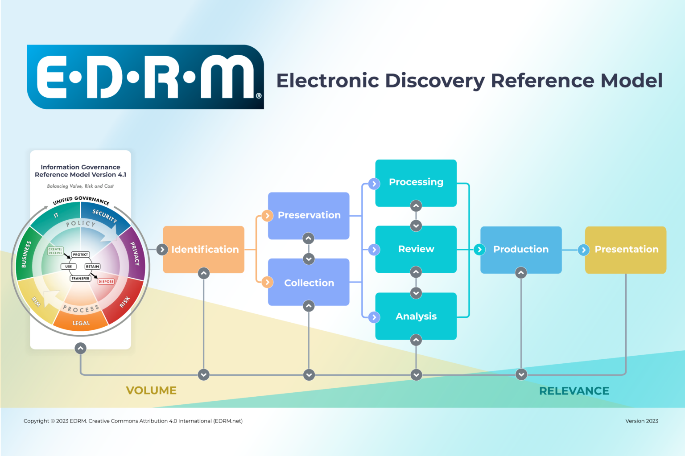

# eDiscovery Starter Repository

**Introduction** 
ediscovery is the subset of data governance which deals with the collection of ESI (electronically stored evidence) in businesses and organizations for use in litigation. In the US, ediscovery has become an increasingly important phase in litigation, and commands up to 60% of litigation costs.

ediscovery has been defined as multiple phases through the EDRM (Electronic Data Reference Model) diagram below.

The aim of ediscovery is to collect data from relevant organizations and individuals when litigation begins with the issuance of a legal hold, and filter the data by relevancy so that it can be used in court by the opposing sides. A legal hold effectively suspends the corporate rules dealing with data life-cycle management, and puts it into a limited scope freeze. On the left side, corporate documents and communications are filtered by relevancy to the case on hand and the individuals involved including communications on corporate and personal devices.

The relevant data is then passed onto the requesting law firm, where the law firm seeks to find the ESIs which support their case. Some of the factual evidence is shared with the opposing law firm. During this phase of the litigation, each side will seek to admit data as evidence which supports their case, while the opposing side will likely challenge the admissibility of evidence.

The aim of the judge is to narrow down the scope of the litigation so that one side will ask for a settlement before it goes to trial. This is because a trial is costly in terms of time and expense, and the results are often unpredictable. In the US, 95% of cases reach a pre-trial settlement.

The dominant software application for data governance and labeling of documents and communications is Microsoft Purview; this is why Purview also includes an ediscovery feature. Its purpose is to help in the various aspects beginning with legal hold, the labeling of review sets, and export to applications which dominate the right-side of the EDRM, which are mostly law firms and LSPs (legal service providers) who provide assistance to law firms.
**Purpose:** Demonstrate professional eDiscovery competency for LSPs/ALSPs/law firms—covering the **EDRM lifecycle**, **chain of custody**, **processing/QC**, **review/production workflows**, and **Relativity‑style load files**. This repo is tool‑agnostic (Relativity, Everlaw, DISCO, Reveal/Brainspace, Nuix, Logikcull).

---

## About Me (short)

- Litigation support / eDiscovery practitioner building repeatable, defensible workflows.
- Comfortable with EDRM from **Identification → Preservation → Collection → Processing → Review → Production**.
- Strong on communication, deadlines, escalation, and documentation.

## What’s Inside

- **docs/**: ESI protocol template, CoC template, metadata/load files, processing checklists, QC, privilege log, production specs.
- **samples/**: Working examples: `.dat` and `.opt` load files + folder structure for natives/images/text.
- **playbooks/**: Intake → Processing → Review → Production workflows you can hand to a team.
- **checklists/**: Short, practical lists for each phase (what to verify).
- **scripts/**: Light utilities (hashing inventory; load file validation; OPT path fixes).
- **evidence/**: Add logs/screenshots here to prove capability (e.g., hashing outputs, QC results).

## Skills Snapshot

- EDRM lifecycle, defensibility, **chain of custody**
- **Load files**: DAT/OPT, images, natives, extracted text
- **Metadata**: BegDoc/EndDoc, Custodian, FilePath, Hash, Date fields, Email threading keys
- **Processing**: deNIST, dedupe (global/custodian/family), hashing, timezone normalization
- **Review**: coding panels, responsiveness, issue tagging, privilege tagging, QC
- **Production**: specs (TIFF/PDF natives), placeholders, redaction workflow, load-file packaging
- **Tools** (familiar): RelativityOne, Everlaw, Nuix concepts, DISCO/Logikcull, Reveal/Brainspace

## Status & Roadmap

- ✅ Initial templates and examples
- 🔜 Add real anonymized evidence exports (hash logs, QC screenshots)
- 🔜 Add small RelativityOne/Everlaw walkthrough (search, batch sets, production)
- 🔜 Add script to validate DAT delimiters and field counts

## License

MIT — see `LICENSE`.
